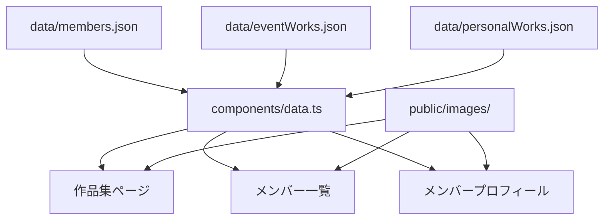

# AITC Web 開発ドキュメント

## 概要

AITC Web は、AITCの活動・イベント作品・個人作品・メンバーを紹介する静的Webサイトです。Next.js App Router、React、TypeScriptを使用し、`next build` で静的ファイルとして出力します。

## ディレクトリ構成

```text
app/                         Next.jsのルーティングと共通スタイル
├── page.tsx                 トップページ (`/`)
├── event-works/page.tsx     イベント作品集 (`/event-works`)
├── personal-works/page.tsx  個人作品集 (`/personal-works`)
└── members/
    ├── page.tsx             メンバー一覧 (`/members`)
    └── [id]/page.tsx        メンバープロフィール (`/members/:id`)

components/                  表示コンポーネント
├── layout.tsx               Server ComponentのFooter、Layout、ロゴ
├── header.tsx               Client Componentのモバイルメニュー
├── work-ui.tsx              Client Componentの作品カードと詳細モーダル
├── data.ts                  JSONデータの読込と共通型・補助関数
├── members.module.css       メンバー一覧専用スタイル
├── site.tsx                 ページコンポーネントの再エクスポート
└── pages/
    ├── home-page.tsx        トップページの内容
    ├── collection-page.tsx  イベント・個人作品集の共通ページ
    ├── members-page.tsx     メンバー一覧とフィルタ
    └── member-page.tsx      メンバープロフィール

data/                        更新対象のJSONデータ
public/images/               サムネイル・メンバーアイコン
docs/                        開発ドキュメント
```

## コンポーネントの責務

| ファイル                                  | 責務                                                                                                     |
| ----------------------------------------- | -------------------------------------------------------------------------------------------------------- |
| `components/layout.tsx`                   | Server Componentの共通レイアウト、フッター、AITCロゴ                                                     |
| `components/header.tsx`                   | モバイルメニューだけを担当するClient Component                                                           |
| `components/work-ui.tsx`                  | `WorkCard` と `WorkModal`。モーダルのEscキー・背景クリック・フォーカストラップも担当するClient Component |
| `components/data.ts`                      | JSONの集約、`Work`・`CollectionKind`型、作品種別ラベル、メンバー参照関数                                 |
| `components/pages/collection-page.tsx`    | Server Componentの作品集ページシェル                                                                     |
| `components/work-collection-browser.tsx`  | URLクエリを正として作品のフィルタ・並び替え・モーダルを扱うClient Component                              |
| `components/pages/members-page.tsx`       | Server Componentのメンバー一覧ページシェル                                                               |
| `components/member-directory-browser.tsx` | URLクエリを正として加入期・所属部門フィルタを扱うClient Component                                        |
| `components/pages/member-page.tsx`        | Server Componentのメンバー詳細                                                                           |
| `components/member-works-browser.tsx`     | メンバー作品のモーダル表示だけを担当するClient Component                                                 |

## ページとデータの関係



## フィルタの実装方針

作品集とメンバー一覧のフィルタは、URLクエリを正とします。たとえば、作品集は `?year=2026&sort=title`、メンバー一覧は `?generation=12&department=CG` のように表します。これによりURL共有とブラウザの戻る・進む操作に対応します。

フィルタ、並び替え、モーダル、モバイルメニューだけをClient Componentに分離しています。共通レイアウト、ページ見出し、プロフィールなどの静的部分はServer Componentとしてレンダリングされます。

## データを更新する方法

データの追加・更新は `data/` 内のJSONを編集します。画像は `public/images/` に置き、JSONの `thumbnail` または `icon` に `/images/ファイル名.svg` の形式で指定します。

詳細なフィールド定義と追加例は [data-management.md](./data-management.md) を参照してください。

## 開発と公開

```bash
# 開発サーバー
npm run dev

# 静的サイトの生成
npm run build
```

ビルド結果は `out/` に出力されます。`out/` は直接ファイルとして開かず、GitHub Pages、Netlify、Cloudflare Pagesなどの静的ホスティング、またはHTTPサーバー経由で公開してください。

## 新しいページを追加する場合

1. `app/` 以下にルート用の `page.tsx` を追加します。
2. 複雑な表示は `components/pages/` に実装します。
3. 共通UIは `components/` の専用ファイルに置きます。
4. 静的パスが必要な動的ルートでは `generateStaticParams` を実装します。
5. `npm run build` で静的出力を確認します。
