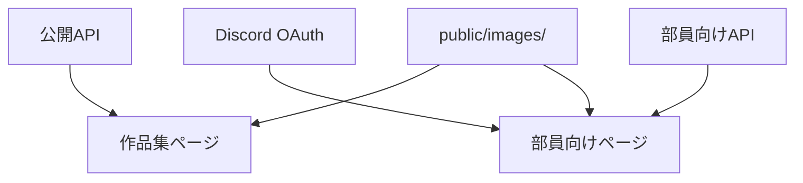

# AITC Web 開発ドキュメント

## 概要

AITC Web は、AITCの活動・イベント作品・個人作品を公開し、Discord認証済み部員向けにメンバー情報を表示するWebサイトです。Next.js App Router、React、TypeScriptを使用し、`next build` で静的ファイルとして出力します。

## ディレクトリ構成

```text
app/                         Next.jsのルーティングと共通スタイル
├── page.tsx                 トップページ (`/`)
├── event-works/page.tsx     イベント作品集 (`/event-works`)
├── personal-works/page.tsx  個人作品集 (`/personal-works`)
└── members-only/
    ├── page.tsx             部員向けメンバー一覧 (`/members-only`)
    └── members/page.tsx     部員向けプロフィール (`/members-only/members?id=...`)

components/                  表示コンポーネント
├── common/
│   ├── layout.tsx           Server ComponentのFooterとLayout
│   ├── header.tsx           Client Componentのモバイルメニュー
│   └── logo.tsx             AITCロゴ
├── members-only/            部員向けページのコンポーネントとスタイル
├── work-ui.tsx              Client Componentの作品カードと詳細モーダル
├── data.ts                  共通型・補助関数
├── members.module.css       メンバー一覧専用スタイル
├── site.tsx                 ページコンポーネントの再エクスポート
└── pages/
    ├── home-page.tsx        トップページの内容
    └── collection-page.tsx  イベント・個人作品集の共通ページ

lib/                         APIクライアントとDiscord認証
public/images/               サムネイル・メンバーアイコン
docs/                        開発ドキュメント
```

## コンポーネントの責務

| ファイル                                  | 責務                                                                                                     |
| ----------------------------------------- | -------------------------------------------------------------------------------------------------------- |
| `components/common/layout.tsx`            | Server Componentの共通レイアウトとフッター                                                               |
| `components/common/header.tsx`            | モバイルメニューだけを担当するClient Component                                                           |
| `components/common/logo.tsx`              | 共通のAITCロゴ                                                                                            |
| `components/work-ui.tsx`                  | `WorkCard` と `WorkModal`。モーダルのEscキー・背景クリック・フォーカストラップも担当するClient Component |
| `components/data.ts`                      | `Work`・`CollectionKind`型、作品種別ラベル、画像パス補助関数                                             |
| `components/pages/collection-page.tsx`    | Server Componentの作品集ページシェル                                                                     |
| `components/work-collection-browser.tsx`  | URLクエリを正として作品のフィルタ・並び替え・モーダルを扱うClient Component                              |
| `components/members-only/members-only-page.tsx` | Discord認証済み部員向け一覧・詳細ページのシェル                                                    |
| `components/members-only/members-only-directory.tsx` | 加入期・所属部門フィルタを扱う部員向けClient Component                                      |
| `components/members-only/members-only-detail.tsx` | 部員プロフィールと制作作品を表示するClient Component                                             |

## ページとデータの関係



## フィルタの実装方針

作品集と部員向けメンバー一覧のフィルタは、URLクエリを正とします。たとえば、作品集は `?year=2026&sort=title`、部員向けメンバー一覧は `?generation=12&department=CG` のように表します。これによりURL共有とブラウザの戻る・進む操作に対応します。

フィルタ、並び替え、モーダル、モバイルメニューだけをClient Componentに分離しています。共通レイアウト、ページ見出し、プロフィールなどの静的部分はServer Componentとしてレンダリングされます。

## データを更新する方法

作品・メンバー情報はAPIから取得します。サイト固有の画像は `public/images/` に配置します。

詳細なフィールド定義と追加例は [data-management.md](./data-management.md) を参照してください。

## 開発と公開

```bash
# 開発サーバー
npm run dev

# 静的サイトの生成
npm run build
```

ビルド結果は `out/` に出力されます。`out/` は直接ファイルとして開かず、GitHub Pages、Netlify、Cloudflare Pagesなどの静的ホスティング、またはHTTPサーバー経由で公開してください。

## 新しいページを追加する場合

1. `app/` 以下にルート用の `page.tsx` を追加します。
2. 複雑な表示は `components/pages/` に実装します。
3. 共通UIは `components/` の専用ファイルに置きます。
4. 静的パスが必要な動的ルートでは `generateStaticParams` を実装します。
5. `npm run build` で静的出力を確認します。
