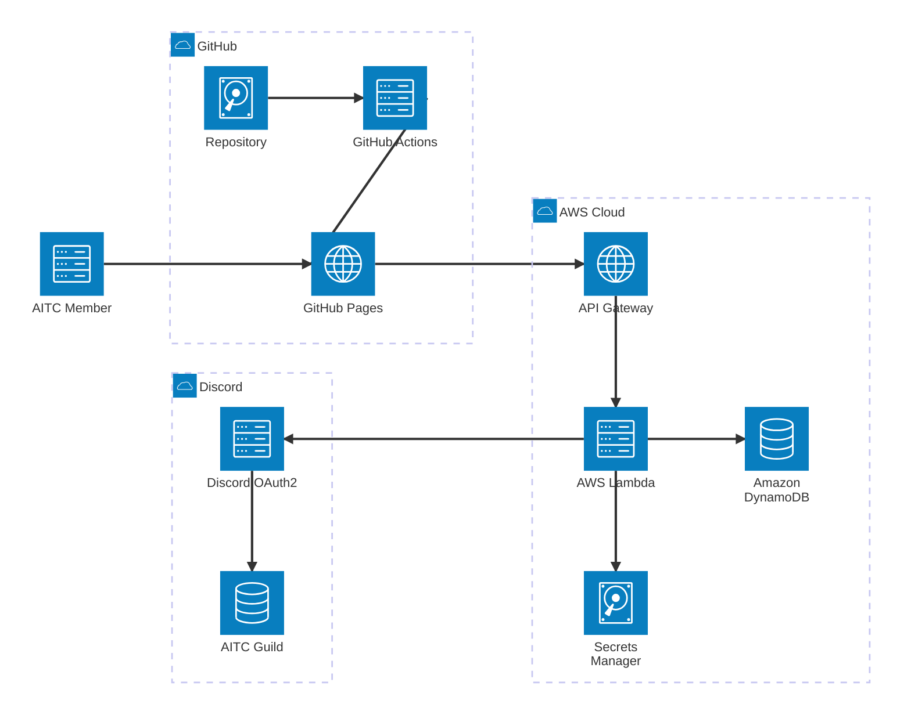

# Discord OAuth2 認証アーキテクチャ



## 認証フロー

1. メンバーがGitHub Pages上のメンバーページを開く。
2. フロントエンドが `GET /auth/session` をAPI Gatewayへ送り、未認証ならDiscordログインへ誘導する。
3. LambdaがDiscord OAuth2の認可コードを交換し、`identify` と `guilds` スコープで取得したGuild一覧にAITCのGuild IDが含まれるか照合する。
4. 所属を確認できた場合、Lambdaは署名済みの `HttpOnly` Cookieを発行する。
5. 認証済みリクエストだけが、Lambdaを経由してDynamoDB上のメンバー情報と個人作品情報を取得できる。

## データ取得と公開範囲

| API | 認証 | 用途 |
| --- | --- | --- |
| `GET /event-works` | 不要 | 公開するイベント作品集の一覧・詳細表示 |
| `GET /members` | Discord OAuth2必須 | メンバー一覧・絞り込み |
| `GET /members/{id}` | Discord OAuth2必須 | メンバープロフィール |
| `GET /personal-works` | Discord OAuth2必須 | 個人作品集の一覧・詳細表示 |

フロントエンドはJSONを静的アセットとして含めず、各ページでAPIから一覧を取得して表示します。

メンバープロフィールはGitHub Pagesで静的に生成しません。URLは次のクエリパラメータ形式に統一します。

```text
/members/profile?id=<member-id>
```

`id` はDynamoDBのデータに応じて増減しても、同じ静的なプロフィールページからAPIへ渡されます。
